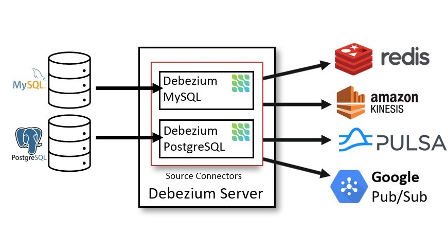

# Next-Gen P2P Database Replication – Infinite Scale!

What if database replication could be blazing fast, truly peer-to-peer, and scalable without limits? No matter how many nodes sync, performance remains lightning-fast. Sounds impossible? We made it happen! 🔥

## Supported Databases? ALL Major Players!

✅ **SQL Server** – Real-time sync across instances.

✅ **Oracle** – Enterprise-grade replication without overhead.

✅ **MySQL & PostgreSQL** – Cross-region, cross-cloud, effortless.

✅ **MongoDB** – Document-based replication at warp speed.

## What Makes This a Breakthrough?

🚀 **Near-Instant Synchronization** – No matter the node count.

🔗 **True P2P Replication** – No central bottlenecks, direct sync.

⚡ **Kafka + Debezium at the Core** – Event-driven CDC supercharged.

🛡️ **Fault-Tolerant & Self-Healing** – Auto-recovery, zero data loss.

🌍 **Massively Scalable** – More nodes = more power, not more latency.

### The Secret Sauce?

🔐 We won’t reveal the algorithm just yet, but here’s the catch – it’s NOT your typical consensus-based replication. No Raft, no Paxos, no slowdowns.

# Understanding Peer-to-Peer (P2P) Database Replication

In traditional database replication, data flows from a primary (leader) node to one or more secondary (follower) nodes. While effective, this model often introduces bottlenecks, single points of failure, and scalability issues.

Peer-to-peer (P2P) database replication eliminates these limitations by allowing every node in the network to act as both a provider and consumer of replicated data. This decentralized approach ensures greater scalability, resilience, and performance.

⸻

## How Does P2P Database Replication Work?

Instead of a single authoritative source, each node in a P2P system synchronizes directly with other nodes. This can be achieved using:

🔹 **Change Data Capture (CDC)** – Tracking changes at the database level.

🔹 **Event-Driven Replication** – Using streaming platforms like Kafka, Pulsar, or NATS.

🔹 **Conflict Resolution Mechanisms** – Handling concurrent writes in a multi-node system.

🔹 **Delta-Based Syncing** – Synchronizing only the changes instead of full data dumps.

⸻

## Why Choose P2P Replication?

✅ **Scalability** - No central node bottleneck – new nodes join seamlessly without performance degradation.

✅ **Fault Tolerance** - Nodes can fail or disconnect without impacting overall system integrity.

✅ **Multi-Region & Multi-Cloud Ready** - Perfect for distributed applications that require real-time data consistency across locations.

✅ **Faster Disaster Recovery** - Since all nodes contain a copy of the data, failover is instantaneous.

⸻

## Use Cases for P2P Database Replication

🚀 **Global-Scale Applications** – Keeping data synchronized across continents.

📡 **IoT & Edge Computing** – Distributed databases for low-latency edge nodes.

💰 **Financial Systems** – High-availability replication across banking networks.

🔍 **Analytics & Big Data** – Real-time aggregation across multiple nodes.

🛡️ **Disaster Recovery & High Availability** – Ensuring no data loss even in outages.

⸻

## Challenges & Considerations

While P2P replication offers many benefits, it also presents challenges:

🔹 **Conflict Resolution** – What happens when two nodes update the same data?

🔹 **Network Efficiency** – How do we avoid excessive synchronization overhead?

🔹 **Security & Trust** – How do nodes verify data integrity?

Innovative algorithms and modern data streaming solutions are addressing these concerns, making P2P replication a powerful alternative to traditional methods.

## Contact 

[**Datamesh sync**](mailto:dbdeveloperexpert@gmail.com)

