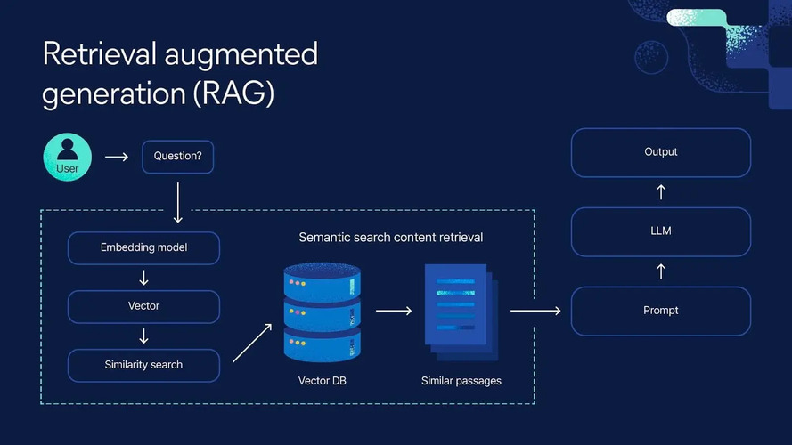

🔍 **AI-Powered Document Intelligence System for CV Analysis (RAG-Based)**

As part of an advanced AI integration initiative, I designed and built a modular Retrieval-Augmented Generation (RAG) system focused on intelligent document processing and semantic search — with a strong emphasis on CV parsing, tagging, and job-fit analysis.

This system enables seamless ingestion, enrichment, and querying of large collections of PDF documents (such as CVs), leveraging both local and cloud-based LLMs like LLaMA 3 and OpenAI GPT-4.1 — all wrapped in a user-friendly Web UI.

💡 **Key Features & Capabilities**

📂 **Document Ingestion & Preprocessing**
- Select one or multiple PDF files from a local folder.
- Automatically convert PDFs into clean plain-text format.
- Add custom tags (e.g. ["Remote", "Senior", "Data Engineer"]) describing document context before import.
- Store and index documents with full-text and metadata into a Qdrant vector database.

🔍 **Semantic Search with Filtering**
- Ask natural language questions about document content (e.g. “Who has experience with Apache Kafka and remote teams?”).
- Dynamically filter by tags such as role, location, seniority, or tech stack.
- Combines vector similarity search with structured tag-based filtering for precise and relevant results.

🤖 **Flexible Model Selection**
- Choose inference mode:
- Local models (LLaMA 3 via Ollama) — ideal for privacy-focused or offline scenarios.
- Cloud-based GPT-4.1 (OpenAI) — for enhanced reasoning and richer output when needed.

🧠 **Prompt Optimization & Output Modes**
- Dynamic prompt generation based on the user’s intent.
- Choose between:
	•	Summarized outputs (e.g. short profile descriptions).
	•	Detailed answers (e.g. listing full work history or relevant technologies).

📤 **Export & Reuse of LLM Outputs**
- Save any generated response in various formats:
	•	.pdf, .md, .docx, .json
- Choose format based on output type or future reuse (e.g. documentation, re-analysis, candidate profile export).
- Ideal for archiving or automated downstream processing.

🌐 **Web-Based User Interface**
- Intuitive Web UI for:
- Uploading PDFs
- Entering metadata tags
- Querying with free-form questions
- Filtering by tags
- Choosing the model and answer type
- Saving results in preferred format

⸻

⚙️ **Tech Stack**
- Python (FastAPI, LangChain)
- Qdrant for vector search and filtering
- Ollama for local LLaMA 3 inference
- OpenAI API for GPT-4.1 access
- Frontend: FastAPI UI (or optionally Streamlit)

⸻

🚀 Example Use Cases
- CV screening and automatic candidate-job matching.
- Knowledge extraction from large internal PDF document sets.
- Private or hybrid RAG setups for sensitive data environments.

⸻

🔧 I offer this system as a customizable solution for recruitment firms, HR platforms, and AI-powered document processing tools.

Let’s talk if you want a demo or custom adaptation.
